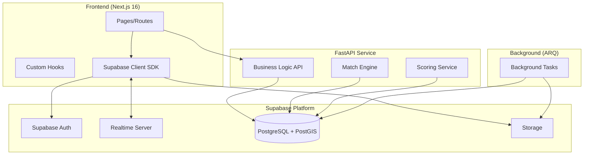
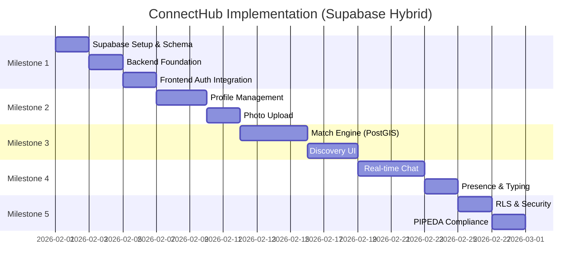

# ConnectHub Implementation Plan (Supabase Hybrid)

> **Architecture**: Supabase (DB, Auth, Realtime, Storage) + FastAPI (Business Logic) + Next.js (Frontend)

---

## Architecture Overview



---

## Tech Stack Summary

| Layer | Technology | Purpose |
|-------|------------|---------|
| **Frontend** | Next.js 16, React 19, TailwindCSS 4 | UI, SSR, routing |
| **Auth** | Supabase Auth | Google/Apple OAuth, sessions |
| **Database** | Supabase PostgreSQL + PostGIS | Data, geospatial queries |
| **Realtime** | Supabase Realtime | Chat, presence, notifications |
| **Storage** | Supabase Storage | Photos, media CDN |
| **API** | FastAPI | Matching logic, scoring |
| **Workers** | ARQ + Redis | Background jobs |

---

## Milestone 1: Foundation & Auth

### 1.1 Supabase Project Setup
- [ ] Create Supabase project (or self-host for PIPEDA)
- [ ] Configure PostGIS extension
- [ ] Set up Google OAuth provider
- [ ] Set up Apple OAuth provider
- [ ] Configure Row Level Security (RLS) policies

### 1.2 Database Schema (Supabase Dashboard or Migrations)

```sql
-- Enable PostGIS
CREATE EXTENSION IF NOT EXISTS postgis;

-- Users table (extends Supabase auth.users)
CREATE TABLE public.profiles (
    id UUID PRIMARY KEY REFERENCES auth.users(id) ON DELETE CASCADE,
    display_name TEXT,
    birthdate DATE NOT NULL,
    gender TEXT,
    looking_for TEXT[],
    bio TEXT,
    location GEOMETRY(POINT, 4326),
    preferences JSONB DEFAULT '{}',
    prompts JSONB DEFAULT '[]',
    is_verified BOOLEAN DEFAULT FALSE,
    subscription_status TEXT DEFAULT 'FREE',
    last_active TIMESTAMPTZ DEFAULT NOW(),
    created_at TIMESTAMPTZ DEFAULT NOW(),
    updated_at TIMESTAMPTZ DEFAULT NOW()
);

-- GIST index for location queries
CREATE INDEX idx_profiles_location ON profiles USING GIST (location);

-- Photos table
CREATE TABLE public.photos (
    id UUID PRIMARY KEY DEFAULT gen_random_uuid(),
    user_id UUID REFERENCES profiles(id) ON DELETE CASCADE,
    storage_path TEXT NOT NULL,
    order_index INT DEFAULT 0,
    is_primary BOOLEAN DEFAULT FALSE,
    moderation_status TEXT DEFAULT 'PENDING',
    created_at TIMESTAMPTZ DEFAULT NOW()
);

-- Swipes table
CREATE TABLE public.swipes (
    id UUID PRIMARY KEY DEFAULT gen_random_uuid(),
    liker_id UUID REFERENCES profiles(id) ON DELETE CASCADE,
    liked_id UUID REFERENCES profiles(id) ON DELETE CASCADE,
    direction TEXT NOT NULL CHECK (direction IN ('LEFT', 'RIGHT', 'SUPER_LIKE')),
    created_at TIMESTAMPTZ DEFAULT NOW(),
    UNIQUE(liker_id, liked_id)
);

CREATE INDEX idx_swipes_liked ON swipes(liked_id, direction);

-- Matches table
CREATE TABLE public.matches (
    id UUID PRIMARY KEY DEFAULT gen_random_uuid(),
    user1_id UUID REFERENCES profiles(id) ON DELETE CASCADE,
    user2_id UUID REFERENCES profiles(id) ON DELETE CASCADE,
    status TEXT DEFAULT 'ACTIVE',
    matched_at TIMESTAMPTZ DEFAULT NOW(),
    expires_at TIMESTAMPTZ,
    UNIQUE(user1_id, user2_id)
);

-- Messages table
CREATE TABLE public.messages (
    id UUID PRIMARY KEY DEFAULT gen_random_uuid(),
    match_id UUID REFERENCES matches(id) ON DELETE CASCADE,
    sender_id UUID REFERENCES profiles(id),
    content TEXT NOT NULL,
    message_type TEXT DEFAULT 'TEXT',
    created_at TIMESTAMPTZ DEFAULT NOW(),
    read_at TIMESTAMPTZ
);

CREATE INDEX idx_messages_match ON messages(match_id, created_at DESC);
```

### 1.3 Backend Setup (FastAPI)

#### [MODIFY] [pyproject.toml](file:///c:/Users/PC/Documents/connecthub/connecthub_be/pyproject.toml)
```toml
dependencies = [
    "fastapi[standard]>=0.115.0",
    "supabase>=2.0.0",
    "asyncpg>=0.29.0",
    "geoalchemy2>=0.15.0",
    "arq>=0.26.0",
    "redis>=5.0.0",
    "httpx>=0.27.0",
    "pydantic-settings>=2.5.0",
    "scikit-learn>=1.5.0",
]
```

#### Directory Structure
```
connecthub_be/
├── app/
│   ├── core/
│   │   ├── config.py          # Supabase + app settings
│   │   ├── supabase.py        # Supabase client init
│   │   └── dependencies.py    # Auth dependencies
│   ├── api/
│   │   └── v1/
│   │       ├── discovery/     # Match engine endpoints
│   │       ├── profiles/      # Profile management
│   │       └── privacy/       # PIPEDA compliance
│   └── workers/
│       └── tasks/             # ARQ background jobs
├── docker-compose.yml
└── main.py
```

### 1.4 Frontend Supabase Integration

#### [NEW] Install Supabase SDK
```bash
npm install @supabase/supabase-js @supabase/ssr
```

#### [NEW] [src/lib/supabase/client.ts](file:///c:/Users/PC/Documents/connecthub/connecthub_fe/src/lib/supabase/client.ts)
```typescript
import { createBrowserClient } from '@supabase/ssr'

export const createClient = () =>
  createBrowserClient(
    process.env.NEXT_PUBLIC_SUPABASE_URL!,
    process.env.NEXT_PUBLIC_SUPABASE_ANON_KEY!
  )
```

#### [NEW] [src/lib/supabase/server.ts](file:///c:/Users/PC/Documents/connecthub/connecthub_fe/src/lib/supabase/server.ts)
```typescript
import { createServerClient } from '@supabase/ssr'
import { cookies } from 'next/headers'

export const createClient = async () => {
  const cookieStore = await cookies()
  return createServerClient(
    process.env.NEXT_PUBLIC_SUPABASE_URL!,
    process.env.NEXT_PUBLIC_SUPABASE_ANON_KEY!,
    {
      cookies: {
        getAll: () => cookieStore.getAll(),
        setAll: (cookies) => cookies.forEach(c => cookieStore.set(c)),
      },
    }
  )
}
```

---

## Milestone 2: Profile & Photo Management

### 2.1 Profile Endpoints (FastAPI)
- [ ] `GET /api/v1/profiles/me` - Get current user profile
- [ ] `PATCH /api/v1/profiles/me` - Update profile
- [ ] `PUT /api/v1/profiles/me/location` - Update location (PostGIS)
- [ ] `PATCH /api/v1/profiles/me/preferences` - Update preferences

### 2.2 Photo Management (Supabase Storage)
- [ ] Configure storage bucket with RLS
- [ ] Frontend direct upload to Supabase Storage
- [ ] Photo reordering endpoint
- [ ] Media validation worker (TODO: NSFW deferred)

### 2.3 Frontend Profile Pages
- [ ] Profile setup wizard (onboarding)
- [ ] Profile edit screen
- [ ] Photo upload component with drag-drop
- [ ] Preferences settings

---

## Milestone 3: Geospatial Match Engine (FastAPI)

### 3.1 Discovery Service
This is where FastAPI shines - complex PostGIS queries and ML scoring.

#### [NEW] [app/api/v1/discovery/service.py](file:///c:/Users/PC/Documents/connecthub/connecthub_be/app/api/v1/discovery/service.py)
```python
async def get_discovery_candidates(
    user_id: UUID,
    location: Point,
    radius_km: int,
    preferences: dict
) -> list[ProfileCard]:
    """
    1. PostGIS ST_DWithin for radius filtering
    2. Preference matching (age, gender, looking_for)
    3. Exclude: already swiped, blocked, inactive
    4. Score and rank by compatibility
    5. Return paginated results with distance
    """
```

### 3.2 Endpoints
- [ ] `GET /api/v1/discovery/profiles` - Get candidate profiles
- [ ] `POST /api/v1/discovery/swipe` - Record swipe + detect match

### 3.3 Match Detection Logic
```python
async def process_swipe(liker_id: UUID, liked_id: UUID, direction: str):
    # Record swipe
    await supabase.table('swipes').insert({...})
    
    # Check for mutual like
    if direction in ('RIGHT', 'SUPER_LIKE'):
        reciprocal = await supabase.table('swipes').select('*').match({
            'liker_id': liked_id,
            'liked_id': liker_id,
            'direction': 'RIGHT'
        }).execute()
        
        if reciprocal.data:
            # Create match
            await create_match(liker_id, liked_id)
            # Trigger notification
            await notify_match(liker_id, liked_id)
```

### 3.4 Frontend Discovery
- [ ] Swipe card stack component
- [ ] Profile detail modal
- [ ] Match celebration animation
- [ ] "It's a Match!" screen

---

## Milestone 4: Real-Time Chat (Supabase Realtime)

### 4.1 Chat Infrastructure
Leverages Supabase Realtime - no custom WebSocket server needed!

#### Frontend Real-time Subscription
```typescript
// Subscribe to new messages
const channel = supabase
  .channel(`match:${matchId}`)
  .on('postgres_changes', {
    event: 'INSERT',
    schema: 'public',
    table: 'messages',
    filter: `match_id=eq.${matchId}`
  }, (payload) => {
    setMessages(prev => [...prev, payload.new])
  })
  .subscribe()
```

### 4.2 Chat Endpoints
- [ ] `GET /api/v1/chat/rooms` - List user's matches/conversations
- [ ] `GET /api/v1/chat/rooms/{match_id}/messages` - Message history
- [ ] `POST /api/v1/chat/rooms/{match_id}/messages` - Send message

### 4.3 Presence (Online Status)
```typescript
// Track online status
const presenceChannel = supabase.channel('online-users')
presenceChannel
  .on('presence', { event: 'sync' }, () => {
    const state = presenceChannel.presenceState()
    setOnlineUsers(Object.keys(state))
  })
  .subscribe(async (status) => {
    if (status === 'SUBSCRIBED') {
      await presenceChannel.track({ user_id: userId })
    }
  })
```

### 4.4 Frontend Chat UI
- [ ] Conversations list
- [ ] Chat room with message bubbles
- [ ] Typing indicators (Presence)
- [ ] Online/offline status badges
- [ ] Image message support

---

## Milestone 5: Security & Compliance

### 5.1 Row Level Security (RLS)
```sql
-- Users can only read their own profile for editing
CREATE POLICY "Users can update own profile"
ON profiles FOR UPDATE
USING (auth.uid() = id);

-- Users can view profiles of potential matches
CREATE POLICY "Users can view discoverable profiles"
ON profiles FOR SELECT
USING (
  is_verified = true 
  AND id != auth.uid()
);

-- Users can only see their own messages
CREATE POLICY "Users can read own messages"
ON messages FOR SELECT
USING (
  sender_id = auth.uid() 
  OR match_id IN (
    SELECT id FROM matches 
    WHERE user1_id = auth.uid() OR user2_id = auth.uid()
  )
);
```

### 5.2 Audit Logging
- [ ] Create audit_logs table
- [ ] Log PII access in FastAPI middleware
- [ ] PIPEDA-compliant data export endpoint

### 5.3 Privacy Endpoints
- [ ] `GET /api/v1/privacy/export` - Export user data
- [ ] `DELETE /api/v1/privacy/account` - Delete account + cascade

---

## Frontend Architecture

### Route Structure
```
src/app/
├── (auth)/
│   ├── login/page.tsx
│   ├── register/page.tsx
│   └── callback/route.ts       # OAuth callback
├── (dashboard)/
│   ├── discover/page.tsx       # Swipe cards
│   ├── matches/page.tsx        # Match list
│   ├── chat/[matchId]/page.tsx # Chat room
│   ├── profile/page.tsx        # View/edit profile
│   └── settings/page.tsx       # Preferences
└── (public)/
    └── page.tsx                # Landing page
```

### Key Components
```
src/components/
├── features/
│   ├── discovery/
│   │   ├── SwipeCard.tsx
│   │   ├── SwipeStack.tsx
│   │   └── MatchModal.tsx
│   ├── chat/
│   │   ├── MessageBubble.tsx
│   │   ├── ChatRoom.tsx
│   │   └── ConversationList.tsx
│   └── profile/
│       ├── ProfileForm.tsx
│       ├── PhotoUpload.tsx
│       └── PromptEditor.tsx
├── layout/
│   ├── Navbar.tsx
│   └── Sidebar.tsx
└── ui/
    └── (shadcn components)
```

### State Management
- **Server State**: Supabase SDK + React Query (TanStack Query)
- **Auth State**: Supabase Auth hooks
- **UI State**: React useState/useReducer
- **Real-time**: Supabase Realtime subscriptions

---

## Verification Plan

### Backend Tests
```bash
# Run FastAPI tests
uv run pytest tests/ -v

# Test PostGIS queries
uv run pytest tests/discovery/ -v
```

### Frontend Tests
```bash
# Run component tests
npm run test

# E2E with Playwright
npm run test:e2e
```

### Integration Testing
- [ ] Auth flow (Google/Apple OAuth)
- [ ] Photo upload to Supabase Storage
- [ ] Real-time chat message delivery
- [ ] Match detection on mutual swipe
- [ ] Location-based discovery

---

## Implementation Timeline



**Estimated Total: ~4-5 weeks** (vs. 12+ weeks with full custom)
